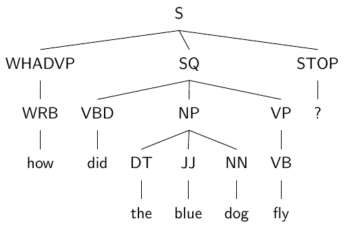
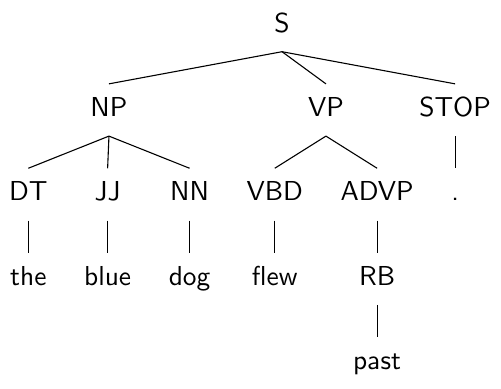
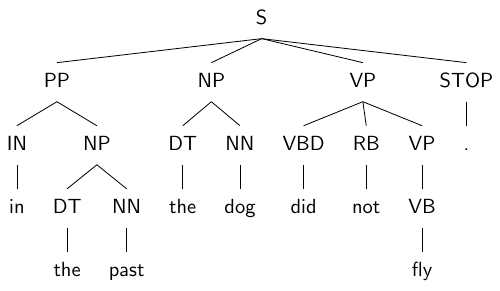

# Week 5: Syntax and Parsing

Carry out all the exercises below and submit your answers
[on Moodle](https://moodle.helsinki.fi/course/view.php?id=44338).
Also submit a single Python file containing your full
implementation.


## 1: Questions from the lectures

### 1.1: Language modelling

Describe the role that a *language model* would play in an
*automatic text recognition* (ATR, a.k.a. *OCR*) tool.

(Hint: it's closely related to how it's used in *speech recognition*.)

<div class="submit">Submit your answer</div>


### 1.2: Statistical methods

A tool for *named-entity recognition* (NER) finds passages of
text that refer to a named entity and link it to an ontology of
known entities (such as people, organisations, etc.).

Describe one way in which statistics derived from a corpus
annotated with named-entity references can be used by the
tool.

Give two reasons why a data-driven, statistical approach
may be preferable to hand-crafted rules for deciding which passages
of text correspond to which entities in the ontology.

<div class="submit">Submit your answers</div>

### 1.3: Syntax

You try parsing a 15-word sentence using a broad-domain, statistical
syntactic parser. The tool returns roughly 5k different syntactic
trees for the sentence.

1. Is this an error in the parsing algorithm?
2. Does it tell us something interesting about this sentence? Or about the language?
3. Probably, these results are not useful for us in further processing of the sentence.
   How might we make them more useful?

<div class="submit">Submit your answers</div>


## 2: CFGs with NLTK

### 2.1: Basic CFG use

NLTK contains a method for loading a CFG from a string.
Here, for example, is the small CFG given in the lecture,
specified in the format NLTK can load.

````python
cfg_rules = """
S -> NP VP
NP -> Det N | PropN
Det -> PosPro | Art
VP -> Vt NP

Art -> 'the' | 'a'
PropN -> 'Alice'
N -> 'duck' | 'telescope' | 'park'
Vt -> 'saw'
PosPro -> 'my' | 'her'
"""
cfg = nltk.CFG.fromstring(cfg_rules)
````

This grammar is almost in Chomsky Normal Form.
The only respect in which it diverges is that it
contains 'unary' rules, like 'NP -> PropN'.
The version of CKY shown in the lecture permits
these and NLTK's `is_flexible_chomsky_normal_form()`
method does too.

````python
print(cfg.is_flexible_chomsky_normal_form())
````







> * Look at the three example trees above, which use
>   Penn Treebank-style expansions.
>   Write a CFG using the above format that produces
>   these tree analyses for the three sentences.
>   (The grammar does not yet need to be in CNF.)
> * Your grammar should have two ways of expanding an
>   `NP` non-terminal (NT). Why?
> * List two other NTs that can be expanded in multiple ways.

<div class="submit">Submit your CFG rules in text form and the answers to the other questions</div>


### 2.2: Extending the grammar

The NLTK CFG type has a method to check that
all the words of the input sentence are covered
by lexical rules in the grammar. Check now that
you've got lexical rules in your grammar for the
three example sentences.

````python
# Check that all the words of the input sentence are covered
sentences = [
    "how did the blue dog fly ?".split(),
    "the blue dog flew past .".split(),
    "in the past the dog did not fly .".split(),
]
for s in sentences:
    grammar.check_coverage(s)
````

Note that this does not check that the grammar
*generates* the sentence – i.e. that there exists
a derivation tree under the grammar that produces
the sentence. It merely checks that there are rules
in the lexicon for all the words in the sentence.

 * Add some more rules to your grammar so that it can
   also generate the following sentences:
   * *"earlier the dog did not fly ."*
   * *"the dog flew without past experience ."*

> * Check that the new, extended grammar can be loaded
>   and that it covers the new sentences as well as the old
>   ones.


<div class="submit">Submit the additional rules you needed to add</div>


### 2.3: Parsing with the grammar

So far, we've only run sanity checks that the words
of sentences are covered by the grammar. We haven't
yet used the grammar to parse the sentences.
NLTK includes implementations of a number of different
parsing algorithms, including the bottom-up chart parsing
algorithm introduced in the lecture – *CKY*.

The example trees include nodes with more than two
children (e.g. the NP covering *"the blue dog"*).
This causes problems for the parsing
algorithm, but any CFG can be converted to
**Chomsky normal form** (CNF) without
changing the sentences it generates.

For example, a rule
````
A -> B C D
````
can be replaced by
````
A -> B2 D
B2 -> B C
````
where `B2` is a new non-terminal.

NLTK's CFG type has a method to perform this transformation for you,
once you have loaded a grammar.

Apply this to the grammar that you extended in the previous exercise.

````python
cnf_grammar = extended_grammar.chomsky_normal_form()
````

Now load a bottom-up chart parser and initialize it with
your CNF grammar:

````python
from nltk.parse.chart import BottomUpChartParser
parser = BottomUpChartParser(cnf_grammar)
parses = list(parser.parse(sentence))
````

The results are tree structures.

If your grammar is correct, you should get at least
one full parse for each of the example sentences in
exercises 1 and 2, repeated here:

````
how did the blue dog fly ?
the blue dog flew past .
in the past the dog did not fly .
earlier the dog did not fly .
the dog flew without past experience .
````

You can use the method `parse.draw()` to display the
parse result graphically.

You might also find it useful (or interesting) to inspect the
chart data structure constructed during bottom-up chart parsing.
You can get this by calling `parser.chart_parse()`:

````python
chart = parser.chart_parse(sentence)
# List all edges
chart.edges()
# Show all the entries in the chart
# (Ignore those with '>' in the chart: just look at those marked '[---]')
chart.pretty_format()
````

Confirm that the trees produced by the parser match
the three example trees (with the exception of the
additional nodes added in normalization of the grammar).

> * How many derivations are found for each sentence?
> * Find at least two other sentences that are generated by your grammar
>   and verify that the parser is able to find a derivation.

<div class="submit">Submit your answers</div>


## 3: Treebank parser

### 3.1: Treebank grammar

NLTK provides easy access to a 10% sample of the Penn
Treebank. The full treebank is not available without a
license, but this sample is enough for us to build a
treebank grammar from.

Start by loading the treebank as follows and taking a
look at a couple of its parse trees, which are instances
of NLTK's [Tree](https://www.nltk.org/api/nltk.html#nltk.tree.Tree)
class:

````python
from nltk.corpus import treebank
print(treebank.parsed_sents()[0])
print(treebank.parsed_sents()[1])
````

Or, graphically:

````python
treebank.parsed_sents()[0].draw()
````
The trees in the corpus are represented using NLTK's own data structures,
including:
 * [Nonterminal](https://www.nltk.org/api/nltk.html#nltk.grammar.Nonterminal): represents non-terminal nodes in the tree
 * [Production](https://www.nltk.org/api/nltk.html#nltk.grammar.Production): represents productions/expansions of the form A->B C (etc.)

The same data structures (classes) are used the represents NTs and
productions in the grammars you created above. When you called
`CFG.fromstring()`, the result was a
[CFG](https://www.nltk.org/api/nltk.html#nltk.grammar.CFG) object,
which contained `Nonterminal`s, `Production`s and strings defining
the CFG (see lectures).

The complete set of productions used in a parse tree is directly
available through its `tree.productions()` method.

Given a set of productions using these NLTK data structures,
you can directly build a CFG as follows:
````python
cfg = nltk.CFG(nltk.Nonterminal("S"), productions)
````

This defines the `S` non-terminal as the start symbol of
the grammar. The set of non-terminals and terminals will be all
of those used in the list of productions.

Build a treebank grammar from all the trees in this sample
of the corpus.

Use your grammar as you did in exercise 4 to parse the following
sentences.

````
Mr. Vinken is chairman .
Stocks rose .
Alan introduced a plan .
````

> * How many parse trees does the parser find
>   for each sentence?
> * What problems do you observe with this parsing
>   process?


<div class="submit">Submit your answers to these questions</div>


### 3.2: PCFG

You will have noticed that your treebank parser produced
a huge number of parse trees for even very short sentences.
Most of these are highly implausible, resulting either from
*overgeneration* by the grammar or from a high level of *local
ambiguity* that could be reasonably well ruled out once the
rest of the sentence is taken into account.

In practice, exhaustive parsing of long sentences becomes
completely impractical.

We will now use the treebank to create a PCFG, learning
the grammar from the corpus, as above, and estimating the
probabilities associated with productions from the same data.

You can, for example, collect all examples in the treebank of
where an `NP` is exanded to something and
use these to estimate a probability distribution for `NP -> ?` rules.

> Bonus exercise (optional):
> Try doing this youself for NPs.

NLTK provides a tool to estimate all the probabilities of
a PCFG from the productions in a treebank.

````python
from nltk import induce_pcfg
pcfg = induce_pcfg(Nonterminal("S"), productions)
````

The probabilities are computed in the same way as you did
in the previous exercise.

NLTK's `InsideChartParser` provides a probabilistic version
of the chart parsing algorithm you used above. It has
a `beam_size` parameter, allowing you to perform
beam search to speed up parsing.

Try parsing the example sentences above, this time with
the PCFG. Experiment with the `beam_size` parameter.

The first parse is now that favoured by the statistical
model and should therefore look much more reasonable than
a randomly chosen example from the exhaustive parse.
Take a look at the top parse(s) and see what you think.

> * What happens if the beam size is too low?
> * Or too high?
> * Do the top parses look better? Are they perfect?

<div class="submit">Submit your answers</div>


### 3.3: Out-of-domain parsing

Now we'll try parsing some data that wasn't in the training
corpus. Your parser can only process sentences made up of
words it has seen before, since it has no mechanism for
guessing what rules to use for unseen words. It will for
the same reason struggle to handle grammatical constructions
that differ from those in the training corpus.

Try feeding some sentences into the PCFG parser, as in ex 5,
to see if you can find any full parses.
You could try coming up with sentences yourself, or taking
them from some other source, like news articles.

They will need to be tokenized
in the same style as the Penn Treebank. You can either do that
manually or use NLTK's `TreebankWordTokenizer`, which
produces PTB-style tokenization.

Try to find sentences that use only words covered by the grammar
(check using `check_coverage()` as above), so there's a chance
the grammar will generate them.

> * Did you find any parsable sentences?
> * How might you extend your parser to increase its coverage, so
>   that it can parse more sentences?

<div class="submit">Submit parsable sentences you managed to find (if any) and a short description of your ideas to extend coverage</div>


## Extension/final project suggestions

### Broad-domain parser

Broad-domain parsing is (still) a difficult open research problem. But perhaps
there are some extensions to this week's probabilistic parser that could
bring it a step or two closer to a usable parser on texts outside the
training corpus.

You could consider something like the following ideas:
 * Experiment with NLTK's other **parsing strategies**. For example, the
   [LongestChartParser](https://www.nltk.org/api/nltk.parse.html#nltk.parse.pchart.LongestChartParser)
   or [RandomChartParser](https://www.nltk.org/api/nltk.parse.html#nltk.parse.pchart.RandomChartParser)
   might do a better job of finding some analyses.
 * Perform **semi-supervised learning** to learn from more data. One
   strategy could be to try parsing lots of (unannotated) sentences,
   then treat those that get a sufficiently high-scoring parse as
   gold-standard trees from which to learn a better model (together with
   the annotated examples).


### Random NLG

Using the above models, you could implement a simple NLG system:
a random sampler that chooses PCFG expansions using trained probabilities.

This is not *real* NLG (as we'll see in later lectures), as the system
has no idea what information it's conveying, but it is quite fun.

Of course, the output depends on the training data, so training on different
treebanks will produce different types of output.

You could then consider what further processing and representations
would be needed to turn this into a useful NLG system. You could even
implement something, if you have time.


### Parsing applications

Syntactic parsing has many applications. Now you know something about
how a statistical parser works, you could try using another parser,
with a pre-trained model available, for a downstream application.

For example, the [CoreNLP](https://stanfordnlp.github.io/CoreNLP/)
parser has models for a number of different languages, or
the [TurkuNLP parser](https://turkunlp.org/Turku-neural-parser-pipeline/)
provides models for Finnish.

Some applications to consider:
 * Simple **information extraction** by specifying templates consisting of
   fragments of constituency or dependency trees.
 * **Identify events** in input sentences by finding the main verb and
   some subset of its arguments. You can consider what information
   you can get from a syntactic tree that is informative for different
   types of events. Applying this to, for example, news articles might
   tell you key information about what is being reported.
 * Look for **typical syntactic patterns** for different words. For example,
   looking at typical adjectives that get applied to a given noun tells
   us something about the noun (or at least how it's used in the corpus).
   Similarly, you might look at adverbs attached to verbs.
